# Custom Fields System Design - Analyse

**Datum:** 2025-11-08  
**Analyse von:** `docs/plans/2025-11-05-custom-fields-system-design.md`

## 🎯 Gesamteindruck

Das Design ist **außergewöhnlich gut durchdacht** und zeigt eine tiefe technische Understanding. Die Architektur löst das Kernproblem - flexible Video-Bewertungen mit kontextspezifischen Kriterien - auf sehr elegante Weise.

## ✅ Stärken des Designs

### 1. Architektur-Entscheidung

Die Wahl des relationalen Ansatzes statt JSONB ist **clever und gut begründet**:

- **Performance-Vorteile:** Optimale Filter-Operationen durch typisierte Spalten
- **Type Safety:** Datenbank-Constraints erzwingen Datenkonsistenz
- **Skalierbarkeit:** PostgreSQL excelt bei Joins mit proper Indizes
- **Konsistenz:** CASCADE deletes verhindern verwaiste Datensätze

### 2. Datenmodell-Design

Das Schema mit den vier Haupttabellen ist **sauber und normalisiert**:

```mermaid
erDiagram
    List ||--o{ CustomField : enthält
    List ||--o{ FieldSchema : enthält
    FieldSchema ||--o{ SchemaField : hat
    CustomField ||--o{ SchemaField : wird verwendet
    Video ||--o{ VideoFieldValue : hat
    CustomField ||--o{ VideoFieldValue : wird bewertet
    Tag }o--|| FieldSchema : bindet
```



**Hervorragende Aspekte:**
- **`custom_fields`**: Globale, wiederverwendbare Felddefinitionen
- **`field_schemas`**: Vorlagen für gruppierte Bewertungskriterien
- **`schema_fields`**: Many-to-Many mit Display-Order Konfiguration
- **`video_field_values`**: Typisierte Wertspeicherung für Performance

### 3. Multi-Tag Union Logic

Der Ansatz für die Konfliktlösung bei unterschiedlichen Schemas ist **pragmatisch und durchdacht**:

- **Gleiche Feldtypen:** Werden intelligent zusammengefasst
- **Verschiedene Typen:** Erhalten Schema-Präfixe zur Unterscheidung
- **Visual Limit:** Maximal 3 Felder auf Karten zur Vermeidung von Überladung

**Beispiel:**


### 4. API-Design

Die REST-Endpoints sind **intuitiv und konsistent**:

- **Klare Trennung:** Fields, Schemas und Values haben eigene Endpoints
- **Praktische Features:** Duplicate-Check Endpoint für bessere UX
- **Performance-Optimiert:** Batch-Updates für Video-Fields
- **Erweiterbar:** Bestehende APIs werden elegant erweitert

## 🤔 Potenzielle Verbesserungen

### 1. Performance-Optimierungen

Das Design erwähnt Indizes, aber könnte noch detaillierter sein:

```sql
-- Composite Indexes für häufige Filter-Kombinationen
CREATE INDEX idx_vfv_field_numeric_filter 
ON video_field_values(field_id, value_numeric) 
WHERE value_numeric IS NOT NULL;

-- Partitioning für sehr große Datensätze
CREATE TABLE video_field_values_2024 PARTITION OF video_field_values
FOR VALUES FROM ('2024-01-01') TO ('2025-01-01');

-- Caching Strategie für Schema-Definitions
CREATE MATERIALIZED VIEW schema_fields_cache AS
SELECT sf.*, cf.name, cf.field_type, cf.config
FROM schema_fields sf
JOIN custom_fields cf ON sf.field_id = cf.id;
```

### 2. Frontend-Komplexität

Die Komponenten-Architektur ist gut, aber könnte **noch modularer** sein:

```typescript
// Bessere Modularisierung
import { FieldComponents } from '@/components/fields/registry';
import { useFieldRenderers } from '@/hooks/useFieldRenderers';

// State Management Delegation
const fieldStore = createFieldStore();
const schemaStore = createSchemaStore();
```

### 3. Validation & Error Handling

```typescript
// Fehlende Client-side Validation Patterns
interface FieldValidationRule {
  validate: (value: any) => ValidationResult;
  message: string;
}

// Rollback-Strategien bei fehlgeschlagenen Batch-Updates
interface BatchUpdateResult {
  successes: FieldValue[];
  failures: FieldValue[];
  rollbackData?: FieldValue[];
}

// Konfliktlösung bei gleichzeitigen Bearbeitungen
interface ConflictResolution {
  strategy: 'last-write-wins' | 'merge' | 'manual';
  timestamp: Date;
  userId: string;
}
```

## 🚀 Besonders Gelungene Aspekte

### 1. User Experience Focus

- **Inline-Editing:** Direkte Bearbeitung auf Video-Karten ohne Modal
- **Visual Hierarchy:** Klare Begrenzung auf 3 sichtbare Felder
- **Contextual Grouping:** Schema-basierte Gruppierung im Detail-Modal

### 2. Skalierbarkeits-Überlegungen

```sql
-- Leistungsoptimierte Indizes
CREATE INDEX CONCURRENTLY idx_vfv_filter_performance 
ON video_field_values(field_id, value_numeric, value_text, value_boolean);

-- Query Optimization für Multi-Tag Unions
WITH video_tags AS (
  SELECT tag_id FROM video_tags WHERE video_id = $1
),
tag_schemas AS (
  SELECT DISTINCT schema_id FROM tags WHERE id IN (SELECT tag_id FROM video_tags)
)
SELECT * FROM schema_fields WHERE schema_id IN (SELECT schema_id FROM tag_schemas);
```

### 3. Entwickler-Erfahrung

- **Klare API-Dokumentation:** Detaillierte Request/Response Beispiele
- **TypeScript Integration:** Vollständige Type Safety
- **Umfassende Test-Strategie:** Unit-, Integration- und Frontend-Tests

## 📈 Business Value

Dieses Design erstellt einen **signifikanten Mehrwert**:

| Aspect | Value Proposition |
|--------|-------------------|
| **Flexibilität** | Unterschiedliche Video-Typen erhalten maßgeschneiderte Kriterien |
| **Wiederverwendbarkeit** | Gemeinsame Bewertungskriterien über verschiedene Tags hinweg |
| **Performance** | Schnelle Filter-Operationen auch bei 1000+ Videos |
| **User Experience** | Intuitive, schnelle Bewertung ohne umständliche Formulare |

## 🎯 Fazit

Das ist ein **Production-Ready Design** mit herausragenden Eigenschaften:

- ✅ **Solide technische Grundlage:** Relationaler Ansatz mit optimaler Performance
- ✅ **Gute Skalierbarkeit:** Indizes, Batch-Operations, Caching-Strategien
- ✅ **Pragmatische UX-Entscheidungen:** Inline-Editing, Visual Limits, Context Grouping
- ✅ **Klarer Implementierungspfad:** Detaillierte API-Spezifikationen und Migrations-Skripte

### Herausforderungen

Die einzige wirkliche Herausforderung wird die **Frontend-Komplexität** bei der Implementierung sein:
- State Management für Multiple Schemas
- Performance bei reaktivem Inline-Editing
- Konfliktlösung bei gleichzeitigen Bearbeitungen

Aber das Design gibt hier eine exzellente Struktur vor, die diese Herausforderungen beherrschbar macht.

## Bewertung

**Gesamtbewertung: 9/10**

Ein exzellentes, durchdachtes System Design, das beide Welten - technische Exzellenz und User Experience - erfolgreich vereint. Die Architektur ist zukunftssicher, skalierbar und bereit für die Implementierung.

---

## Nächste Schritte

1. **Performance Testing:** Benchmark mit 10.000+ Videos und 50+ Feldern
2. **Frontend Prototyping:** UI/UX Tests für Inline-Editing Experience
3. **Security Review:** Validierung und Authorization Patterns überprüfen
4. **Documentation:** API-Dokumentation für Frontend-Team finalisieren