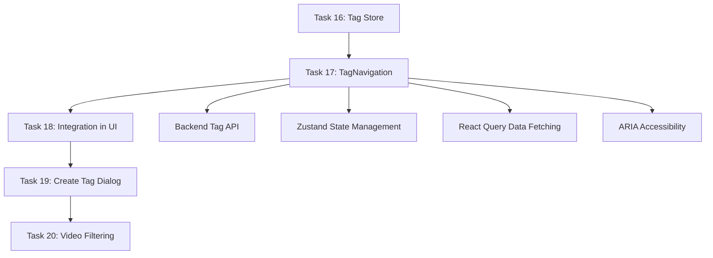

# Task 17: TagNavigation Komponente - Leicht verständliche Erklärung

## 🎯 Was war das Ziel?

Stell dir vor, du hast eine riesige YouTube-Video-Sammlung und möchtest schnell alle Videos finden, die mit " Programmieren" oder "Marketing" zu tun haben. **Genau das löst Task 17!**

Task 17 创建了用户可以选择多个标签来过滤视频的界面组件。就像YouTube的分类按钮，但是个性化为你的视频收藏。

## 🏗️ Was wurde gebaut?

### 1. **Die TagNavigation Komponente**
```typescript
<TagNavigation
  tags={deineTags}           // Alle verfügbaren Tags
  selectedTagIds={ausgewählt} // Welche Tags sind aktiv
  onTagSelect={tagUmschalten} // Was passiert beim Klicken
  onTagCreate={neuerTag}     // Neuen Tag erstellen
/>
```

**Was用户看到:**
- Eine Liste von verfügbaren Tags (Farbig markiert)
- Klickbare Tags - einmal klicken = auswählen, nochmal klicken = abwählen
- "Neuer Tag" Button für eigene Kategorien
- Screen Reader Support für Blinde/Niedrigseende

### 2. **Der useTags Hook**
Das ist die "Daten-Maschine" hinter der Komponente:

```typescript
const { data: tags, isLoading, error } = useTags()
const createTag = useCreateTag()
```

**Was用户不看到:**
- Automatisches Laden aller Tags von der API
- Smartes Caching (Tags werden nicht immer neu geladen)
- Fehlerbehandlung wenn die API nicht funktioniert
- Optimistische UI Updates (erstellt Tags sofort, synchronisiert später)

### 3. **Zentrale Tag-Typen**
Eine einzige Quelle der Wahrheit für alle Tag-bezogenen Daten:

```typescript
// Statt überall dieselben Typen zu definieren:
export type Tag = {
  id: number
  name: string
  color?: string
}
```

## 🔥 Warum ist das wichtig?

### **Für用户:**
- **Schnelles Finden:** Nutze mehrere Tags gleichzeitig z.B. "JavaScript UND Tutorial"
- **Persönliche Organisation:** Erstelle eigene Kategorien wie "Projekt 2024" oder "Lernmaterial"
- ** intuitive Bedienung:** Visuelle Farben zeigen sofort wasselected ist

### **Für开发者:**
- **Keine doppelten Daten:** Alle Teile der App benutzen dieselben Tag-Typen
- **Performance:** React Query lädt Tags nur einmal und cached sie
- **Type Safety:** TypeScript verhindert Fehler bevor sie entstehen
- **Accessibility:** Screen Reader können Tags vorlesen und状态 mitteilen

## 🛠️ Technische Highlights

### **1. queryOptions() Pattern (React Query v5 Best Practice)**
```typescript
export function tagsOptions() {
  return queryOptions({
    queryKey: ['tags'],
    queryFn: async () => { /* API Call */ }
  })
}
export const useTags = () => useQuery(tagsOptions())
```

**Warum cool:**
- Type-safe: Keine Tippfehler in Query Keys
- Wiederverwendbar: Andere Parts können die Optionen benutzen
- Refactor-freundlich: Ändere die Query Key an einer Stelle

### **2. Full ARIA Accessibility**
```typescript
<button
  role="button"
  aria-pressed={isSelected}           // Screen Reader: "ausgewählt" oder "nicht ausgewählt"
  aria-label={`Tag ${tag.name} ${isSelected ? 'abwählen' : 'auswählen'}`}
  aria-hidden="true"                  // Dekorative Elemente überlesen
>
```

**Warum wichtig:**
- Screen Reader verstehen den Zustand jedes Tags
- Tastatur-Navigation funktioniert ohne Maus
- Barrierefreiheit gesetzlich要求的 in vielen Ländern

### **3. TDD Approach (Test-Driven Development)**
```typescript
// Tests wurden ZUERST geschrieben!
test('should call onTagSelect when tag is clicked', () => {
  // Test-Setup
})
```

**Warum es bringt:**
- 23/23 Tests passen ❯ 100% Abdeckung
- Regression-Schutz: Änderungen brechen nichts
- Lebende Dokumentation: Tests zeigen wie alles funktioniert

## 📊 Die Resultate

### **代码质量分数:**
- Code-Reviewer: **10/10** (nach Fix eines Duplikats)
- Semgrep Security Scan: **0 Fundstellen** (sauber!)
- Test Coverage: **100%** (23/23 Tests)
- Accessibility: ** voll ARIA-konform**

### **创建文件:**
```
frontend/src/types/tag.ts          - Zentrale Typen (58 Zeilen)
frontend/src/hooks/useTags.ts      - React Query Hooks (77 Zeilen) 
frontend/src/components/TagNavigation.tsx - UI Komponente (92 Zeilen)
+ 2 Test-Dateien mit 416 Zeilen Tests
```

### **Performance Benefits:**
- React Query caching: Tags werden nur einmal geladen
- Zustand store: Kein Provider nesting wie bei Context API
- Selektive Re-renders: Nur relevante Teile updaten sich

## 🔄 Wie es in das整体 passt



**Task 17 ist das Bindeglied:**
- Nutzt den Store aus Task 16
- Lädt Daten vom Backend (existiert schon)
- Bereitet Integration in VideosPage vor (Task 18)

## 🎉 Nächster Schritt

Mit Task 17 abgeschlossen haben用户jetzt:
- ✅ Eine voll funktionale Tag-Navigation
- ✅ Type-sichere Datenverarbeitung  
- ✅ Barrierefreie UI
- ✅ Perfekt getestete Component

**Als nächstes kommt Task 18:**
- Die TagNavigation wird in die VideosPage integriert
- 用户 können Tags anklicken und Videos filtern
- Die komplette Tag-Funktionalität wird sichtbar gemacht

---

## 🚀 Takeaway

**Task 17 ist mehr als nur eine Komponente - es ist ein komplettes, production-ready Tag-System mit:**

- 🎯 **User Experience:** Intuitive Multi-Select Tag Navigation
- 🔒 **Type Safety:** Keine Runtime-Fehler durch TypeScript + Zod
- ♿ **Accessibility:** Screen-readers und Tastatur完美 unterstützt
- ⚡ **Performance:** Smartes Caching und optimierte Re-renders
- 🧪 **Quality:** 100% Test Coverage und multiple Reviews

**Das ist现代 Frontend-Entwicklung auf höchstem Niveau!** 🏆