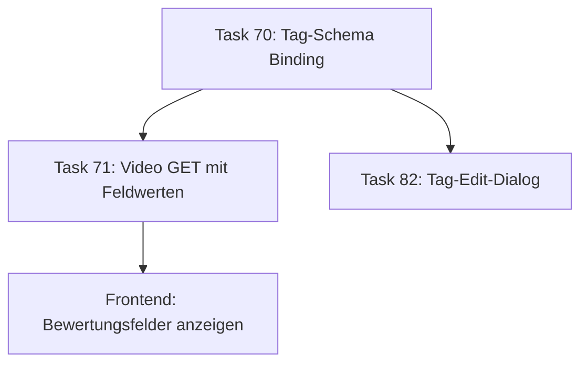

# Task #70 Erklärung – Tag‑Schema‑Binding für Custom Fields

## 🎯 Das Kernkonzept

Stell dir vor, du hast Tags (Schlagwörter) für YouTube-Videos. Task 70 ermöglicht es, diese Tags mit **Bewertungsvorlagen** zu verknüpfen:

**Vorher:** Tags konnten nur Namen und Farben haben
**Nachher:** Tags können Bewertungskriterien enthalten (z.B. "Qualität", "Wissenswertigkeit")

### 🔧 Was genau wurde implementiert

1. **PUT /tags/{id} Endpoint erweitert:**
   - `{"schema_id": "uuid"}` - Schema binden
   - `{"schema_id": null}` - Schema entbinden
   - Feld nicht senden - Schema unverändert lassen

2. **Sicherheits-Validierungen:**
   - Existiert das Schema? (404 wenn nicht)
   - Gehört das Schema zum gleichen Benutzer? (400 wenn nicht)
   - Deutsche Fehlermeldungen

3. **Performance-Optimierung:**
   - `selectinload()` verhindert N+1 Queries
   - JOIN-basierte Validation (1 Query statt 2)

## 🏗️ Warum ist das wichtig?

Task 70 ist ein **kritischer Baustein** für das gesamte Bewertungssystem:



Ohne Task 70 funktionieren Tasks 71, 74 und das gesamte Frontend-Bewertungssystem nicht.

## 📊 Schema-Struktur Beispiel:
```
Tag "YouTube-Tutorial"
├── name: "YouTube-Tutorial"
├── color: "#FF5722"
└── schema_id → FieldSchema "Lernqualität"
    ├── field: "Verständlichkeit" (rating 1-5)
    ├── field: "Praxisbezug" (rating 1-5)
    └── field: "Gesamteindruck" (Text)
```

## ⚡ Die 5 REF MCP Verbesserungen:

1. **Einfacheres Default-Handling** - `schema_id: UUID | None = None`
2. **Bestehende Schemas wiederverwenden** - `FieldSchemaResponse` importieren
3. **JOIN-Validation** - Schema-Existenz + Besitz in 1 Query
4. **Redundantes refresh() entfernen** - Direkt neu laden
5. **Schritt-Nummerierung korrigiert** - Bessere Struktur

## 🎉 Endergebnis

Benutzer können jetzt:
- Tags mit Bewertungsvorlagen verknüpfen
- Videos mit diesen Tags bewerten
- Schema-Bindungen jederzeit ändern/entfernen

Task 70 ist bereits **abgeschlossen** (56 Minuten) und hat die Grundlage für das个性化的 Bewertungssystem geschaffen.